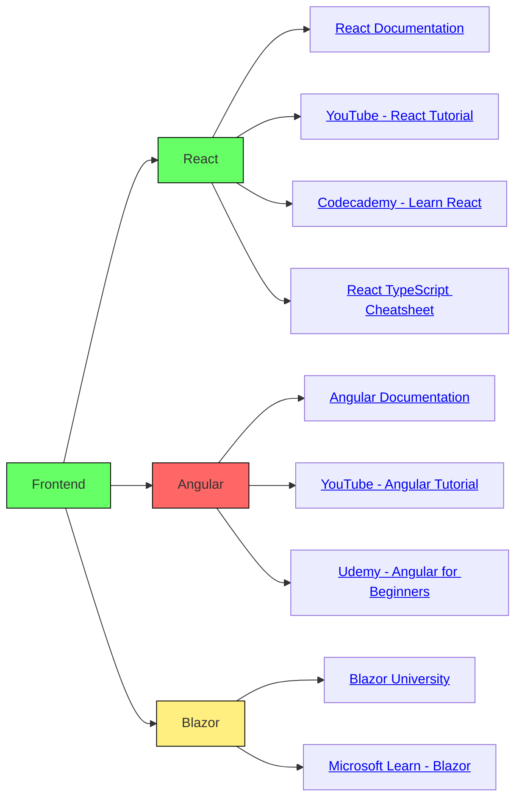
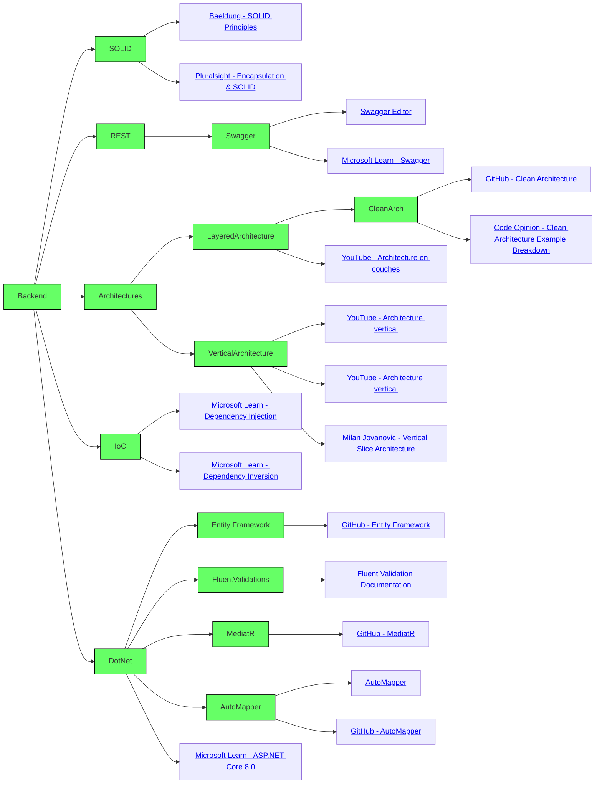
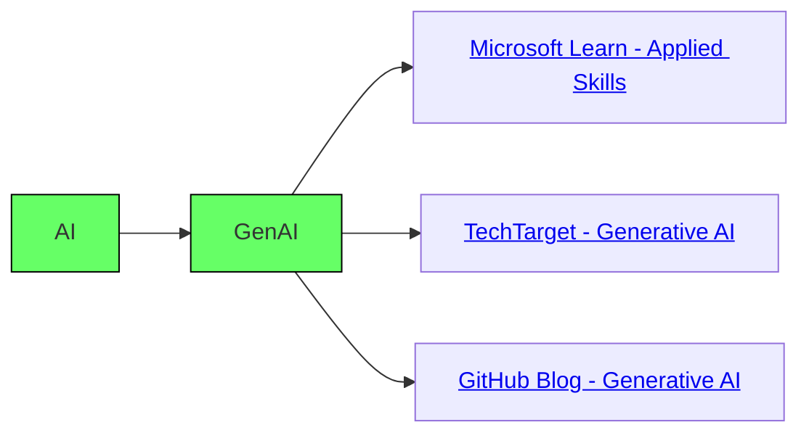

# Prémisse
Nous utilisons chez Nexus une foule d'outils et technologies dans le cadre de notre travail. Vous trouverez ici une liste de sujets et de ressources assez large, sans non plus aller dans le détail extrême. Bref, il y a d'autres outils que nous utilisons qui n'y figurent pas. Il n'en demeure pas moins que si vous connaissez l'ensemble de ces éléments, vous êtes en terrain connu.

Quel est le but ici avec ceci ? D'abord ça se veut un outil de référence pour notre équipe interne. Tout individu a ses forces et faiblesses et il est difficile de tout maitriser, alors quelqu'un qui veut se familiariser avec un sujet précis peut s'inspirer de ce qui se trouve ici comme point de départ. On cible ici des ressources pour se _familiariser_ avec un sujet et non nécessairement en devenir un expert. 

Nous rendons cette base de connaissance publique pour plusieurs raisons. Nous croyons que toute personne intéressée à rejoindre Nexus devrait avoir l'opportunité de se former sur ce que nous utilisons au préalable au lieu d'émettre des hypothèses sur ce qu'elle _doit_ connaitre. Ceci permet aussi de retirer tout ambiguité; si ces technologies ne vous parlent pas, vous risquez d'avoir quelques déceptions. Tout est en mouvement, alors ça ne restera pas figé ainsi, mais il y a quand même des éléments qui sont clés : nous sommes sur Azure, alors nous n'irons pas sur AWS ou faire du _on-premise_ ni devenir une compagnie de Java. Enfin, si vous ne l'avez pas déjà deviné, nous ne sommes pas des monstres sanguinaires ➡️ si vous passez une entrevue avec nous, nous espérons (vraiment !) que tout y soit afin que vous réussissiez. Cette documentation est un outil de plus afin de vous aider à réussir. 

Si jamais vous pensez que d'apprendre tout ça, surtout en par coeur avant de passer une entrevue pour avoir un poste chez Nexus vous offrira un _golden ticket_, nous espérons vous rassurer en vous disant que ça n'est pas le cas. Bien que certains éléments peuvent être discutés ou traités, nous n'aimons pas particulièrement que des réponses de par coeur nous soient récitées. Maitriser tout ça n'est pas une attente non plus.

Si jamais vous avez des recommandations à nous faire sur des ressources additionnelles pour certains sujets, vous êtes les bienvenus à collaborer à cette liste avec nous. 

# MindMap
Le MindMap suivant permet d'avoir un aperçu graphique de l'ensemble des outils que nous utilisons. Des couleurs ont été appliquées afin de vous aider à prioriser les éléments qui pourront vous servir. Voici leur codification et les raisons qui font que nous établissons une couleur pour un sujet :

Vert : Important à court terme, on s'en sert déjà dans la grande majorité des projets ou ça fait parti de nos objectifs

Jaune : Ça peut faire partie de nos solutions bien que ce ne soit pas nécessairement le cas. On est entrain de développer ce sujet pour l'utiliser davantage. Ça l'a déjà servi par le passé dans des solutions

Rouge : Peut être pertinent dans des cas particuliers. Nous nous en sommes déjà servi, mais ça n'est plus tant le cas. On envisage s'en servir, mais la connaissance est très limitée et ça risque de prendre un peu de temps avant que ça soit la norme

```mermaid
  graph LR
    DevOps["DevOps"]
  
      DevOps --> CICD  
      CICD --> FeatureFlags  
      FeatureFlags --> FF_Blog["<a href='https://timdeschryver.dev/blog/feature-flags-in-net-from-simple-to-more-advanced#azure-feature-management'>Tim Deschryver - Feature Flags in .NET</a>"]  
    
      CICD --> BlueGreen  
      BlueGreen --> BlueGreenAcademy["<a href='https://k21academy.com/microsoft-azure/az-303/blue-green-deployment-in-azure/'>K21 Academy - Blue/Green Deployment in Azure</a>"]  
    
      CICD --> Pipelines  
      Pipelines --> CircleCIPipelines["<a href='https://circleci.com/blog/what-is-a-ci-cd-pipeline/'>CircleCI - What is a CI/CD Pipeline</a>"]  
      Pipelines --> YAMLMS["<a href='https://learn.microsoft.com/en-us/azure/devops/pipelines/yaml-schema/?view=azure-pipelines'>Microsoft Learn - YAML Pipelines Schema</a>"]  
    
      CICD --> IaC  
      IaC --> Bicep  
      Bicep --> BicepLearn["<a href='https://learn.microsoft.com/en-us/training/paths/fundamentals-bicep/'>Microsoft Learn - Bicep</a>"]  
      Bicep --> BicepOverview["<a href='https://learn.microsoft.com/en-us/azure/azure-resource-manager/bicep/overview?tabs=bicep'>Microsoft Learn - Bicep Overview</a>"]  
    
      IaC --> ARM  
      ARM --> ARMLearn["<a href='https://learn.microsoft.com/en-us/azure/azure-resource-manager/templates/overview'>Microsoft Learn - ARM Template</a>"]  
    
      IaC --> Terraform  
      Terraform --> TerraformIntro["<a href='https://developer.hashicorp.com/terraform/intro'>HashiCorp - Terraform</a>"]  
      Terraform --> TerraformLearn["<a href='https://learn.microsoft.com/en-us/azure/developer/terraform/overview'>Microsoft Learn - Terraform</a>"]  
      Terraform --> TerraformResourceGroup["<a href='https://learn.microsoft.com/en-us/azure/developer/terraform/create-resource-group?tabs=azure-cli'>Microsoft Learn - Create Resource Group</a>"]  
    
      CICD --> Git  
      Git --> GitTutorial["<a href='https://product.hubspot.com/blog/git-and-github-tutorial-for-beginners'>HubSpot - Git and GitHub Tutorial for Beginners</a>"]  
    
      CICD --> TrunkBased  
      TrunkBased --> TrunkAtlassian["<a href='https://www.atlassian.com/continuous-delivery/continuous-integration/trunk-based-development'>Atlassian - Trunk-based Development</a>"]  
    
      DevOps --> AutomatedTests  
      AutomatedTests --> UnitTests  
      UnitTests --> UnitTestingDotNet["<a href='https://learn.microsoft.com/en-us/dotnet/core/testing/unit-testing-with-dotnet-test'>Microsoft Learn - Unit Testing with .NET</a>"]  
    
      UnitTests --> MockingFrameworks  
      MockingFrameworks --> FakeItEasy["<a href='https://fakeiteasy.github.io/'>FakeItEasy</a>"]  
      MockingFrameworks --> NSubstitute["<a href='https://nsubstitute.github.io/'>NSubstitute</a>"]  
    
      UnitTests --> Assertions  
      Assertions --> FluentAssertions["<a href='https://fluentassertions.com/'>Fluent Assertions</a>"]  
    
      UnitTests --> AutoInstances  
      AutoInstances --> AutoFixture["<a href='https://github.com/AutoFixture/AutoFixture'>AutoFixture</a>"]  
      AutoInstances --> FakerJS["<a href='https://fakerjs.dev/'>Faker.js</a>"]  
    
      UnitTests --> TestingFrameworks  
      TestingFrameworks --> xUnit["<a href='https://xunit.net/'>xUnit</a>"]  
      TestingFrameworks --> Jest["<a href='https://jestjs.io/'>Jest</a>"]  
      TestingFrameworks --> MSTest["<a href='https://learn.microsoft.com/en-us/dotnet/core/testing/unit-testing-with-mstest'>Microsoft Learn - MSTest</a>"]  
    
      AutomatedTests --> IntegrationTesting  
      IntegrationTesting --> IntegrationGeeks["<a href='https://www.geeksforgeeks.org/software-engineering-integration-testing/'>GeeksforGeeks - Integration Testing</a>"]  
    
      AutomatedTests --> E2ETesting  
      E2ETesting --> Playwright["<a href='https://playwright.dev/'>Playwright</a>"]  
      E2ETesting --> TestCafe["<a href='https://testcafe.io/'>TestCafe</a>"]  
    
      AutomatedTests --> CodeCoverage  
      CodeCoverage --> AtlassianCoverage["<a href='https://www.atlassian.com/continuous-delivery/software-testing/code-coverage'>Atlassian - Code Coverage</a>"]  
    
      AutomatedTests --> MutationTesting  
      MutationTesting --> MutationGeeks["<a href='https://www.geeksforgeeks.org/software-testing-mutation-testing/'>GeeksforGeeks - Mutation Testing</a>"]  
      MutationTesting --> Stryker["<a href='https://stryker-mutator.io/'>Stryker Mutator</a>"]  
      MutationTesting --> NexusMutation["<a href='https://github.com/NexusInnovation/nexlab.mutationtesting'>GitHub - Nexus Innovation</a>"]  

      DevOps --> Documentation
      Documentation --> Diataxis  
      Diataxis --> DiataxisBlog["<a href='https://idratherbewriting.com/blog/what-is-diataxis-documentation-framework'>I'd Rather Be Writing - Diataxis Documentation Framework</a>"]  
      Diataxis --> DiataxisFr["<a href='https://diataxis.fr/'>Diataxis</a>"]

      classDef redNodes fill:#F66,stroke:#000;
      classDef yellowNodes fill:#FFEF80,stroke:#000;
      classDef greenNodes fill:#66FF66,stroke:#000;

      class DevOps,CICD,Pipelines,IaC,Bicep,Git,TrunkBased,AutomatedTests,UnitTests,MockingFrameworks,Assertions,AutoInstances,TestingFrameworks,IntegrationTesting,CodeCoverage, greenNodes;
      class FeatureFlags,BlueGreen,E2ETesting,MutationTesting,Documentation,Diataxis yellowNodes;
      class ARM,Terraform redNodes;
```

```mermaid
  graph LR
    Azure["Azure"]  

    Azure --> AzureContainerApps  
    AzureContainerApps --> ACAVideo1["<a href='https://www.youtube.com/watch?v=yAtMgufv7Aw'>YouTube - Azure Container Apps</a>"]  
    AzureContainerApps --> ACAVideo2["<a href='https://www.youtube.com/watch?v=yGrE_yKWo58'>YouTube - Azure Container Apps</a>"]  
    AzureContainerApps --> ACALearn["<a href='https://learn.microsoft.com/en-us/azure/container-apps/overview'>Microsoft Learn - Azure Container Apps</a>"]  
  
    Azure --> AzureMonitoring  
    AzureMonitoring --> KQL  
    KQL --> KQLAzure["<a href='https://azure-training.com/azure-data-science/the-kusto-query-language/'>Azure Training - KQL</a>"]  
    KQL --> KQLPlural["<a href='https://www.pluralsight.com/resources/blog/cloud/what-is-kusto-query-language-kql'>Pluralsight - KQL</a>"]  
    KQL --> KQLMS["<a href='https://learn.microsoft.com/en-us/azure/data-explorer/kusto/query/'>Microsoft Learn - KQL</a>"]  
  
    AzureMonitoring --> MetricsAlerts  
    MetricsAlerts --> AlertsOverview["<a href='https://learn.microsoft.com/en-us/azure/azure-monitor/alerts/alerts-overview'>Microsoft Learn - Alerts Overview</a>"]  
  
    AzureMonitoring --> AppInsights  
    AppInsights --> AppInsightsYT["<a href='https://www.youtube.com/watch?v=A0jAeGf2zUQ'>YouTube - App Insights</a>"]  
    AppInsights --> AppInsightsLab["<a href='https://azuredevopslabs.com/labs/vsts/monitor/'>Azure DevOps Labs</a>"]  
    AppInsights --> AppInsightsLearn["<a href='https://learn.microsoft.com/en-us/azure/azure-monitor/app/app-insights-overview'>Microsoft Learn - App Insights</a>"]  
  
    Azure --> AzureNetworking  
    AzureNetworking --> Vnet  
    Vnet --> VnetOverview["<a href='https://learn.microsoft.com/en-us/azure/virtual-network/virtual-networks-overview'>Microsoft Learn - Vnet Overview</a>"]  
  
    AzureNetworking --> AzureDNS  
    AzureDNS --> DNSRecords["<a href='https://learn.microsoft.com/en-us/azure/dns/dns-zones-records'>Microsoft Learn - DNS Zones Records</a>"]  
  
    Azure --> AzureFunctionApps  
    AzureFunctionApps --> FARevDebug["<a href='https://revdebug.com/blog/azure-functions-overview-use-cases/'>Revdebug - Azure Functions</a>"]  
    AzureFunctionApps --> FAYT["<a href='https://www.youtube.com/watch?v=Vxf-rOEO1q4'>YouTube - Azure Functions</a>"]  
    AzureFunctionApps --> FALearn["<a href='https://learn.microsoft.com/en-us/azure/azure-functions/functions-overview?pivots=programming-language-csharp'>Microsoft Learn - Functions Overview</a>"]  
  
    Azure --> AzureAKS  
    AzureAKS --> AKSYT["<a href='https://www.youtube.com/watch?v=c4nTKMU6fBU'>YouTube - AKS</a>"]  
    AzureAKS --> AKSLearn["<a href='https://learn.microsoft.com/en-us/azure/aks/what-is-aks'>Microsoft Learn - AKS</a>"]  
  
    Azure --> AzureWebApps  
    AzureWebApps --> WebAppsYT["<a href='https://www.youtube.com/watch?v=4BwyqmRTrx8'>YouTube - WebApps</a>"]  
    AzureWebApps --> WebAppsLearn["<a href='https://learn.microsoft.com/en-us/azure/app-service/overview'>Microsoft Learn - WebApps Overview</a>"]  
  
    Azure --> AzureMessaging  
    AzureMessaging --> QueueVSBus["Queue vs Azure Service Bus"]  
    QueueVSBus --> QueueVSBusLearn["<a href='https://learn.microsoft.com/en-us/azure/service-bus-messaging/service-bus-azure-and-service-bus-queues-compared-contrasted'>Microsoft Learn - Comparison</a>"]  
  
    AzureMessaging --> Queues  
    Queues --> QueuesLearn["<a href='https://learn.microsoft.com/en-us/azure/storage/queues/storage-queues-introduction'>Microsoft Learn - Queues Introduction</a>"]  
  
    AzureMessaging --> AzureEH  
    AzureEH --> EHLearn["<a href='https://learn.microsoft.com/en-us/azure/event-hubs/event-hubs-about'>Microsoft Learn - Event Hub</a>"]  
  
    AzureMessaging --> AzureEG  
    AzureEG --> EGLearn["<a href='https://learn.microsoft.com/en-us/azure/event-grid/overview'>Microsoft Learn - Event Grid</a>"]  
  
    AzureMessaging --> AzureSB  
    AzureSB --> SBLearn["<a href='https://learn.microsoft.com/en-us/azure/service-bus-messaging/service-bus-messaging-overview'>Microsoft Learn - Service Bus Overview</a>"]  
  
    Azure --> AzureStorage  
    AzureStorage --> BlobStorage  
    BlobStorage --> BlobLearn["<a href='https://learn.microsoft.com/en-us/azure/storage/common/storage-account-overview'>Microsoft Learn - Storage Account Overview</a>"]  
  
    Azure --> AzureDB  
    AzureDB --> AzureSQL  
    AzureSQL --> ElasticJobs  
    ElasticJobs --> ElasticJobsLearn["<a href='https://learn.microsoft.com/en-us/azure/azure-sql/database/elastic-jobs-overview?view=azuresql'>Microsoft Learn - Elastic Jobs</a>"]  
  
    AzureSQL --> ElasticPools  
    ElasticPools --> ElasticPoolsLearn["<a href='https://learn.microsoft.com/en-us/azure/azure-sql/database/elastic-pool-overview?view=azuresql'>Microsoft Learn - Elastic Pools</a>"]  
  
    AzureSQL --> SQLSync  
    SQLSync --> SQLSyncLearn["<a href='https://learn.microsoft.com/en-us/azure/azure-sql/database/sql-data-sync-data-sql-server-sql-database?view=azuresql'>Microsoft Learn - SQL Sync</a>"]

    classDef redNodes fill:#F66,stroke:#000;
    classDef yellowNodes fill:#FFEF80,stroke:#000;
    classDef greenNodes fill:#66FF66,stroke:#000;

    class Azure,AzureMonitoring,AppInsights,AzureFunctionApps,AzureWebApps,AzureStorage,BlobStorage,AzureDB,AzureSQL greenNodes;
    class KQL,MetricsAlerts,AzureNetworking,Vnet,AzureDNS,AzureMessaging,Queues,AzureEH,AzureEG,AzureSB,ElasticJobs,ElasticPools yellowNodes;
    class AzureContainerApps,AzureAKS,SQLSync redNodes;
```

# Ressources

### Frontend

- 🧠 **React**
  - [React Documentation](https://react.dev/reference/react)
  - [YouTube - React Tutorial](https://www.youtube.com/watch?v=SqcY0GlETPk)
  - [Codecademy - Learn React](https://www.codecademy.com/learn/react-101)
  - [React TypeScript Cheatsheet](https://react-typescript-cheatsheet.netlify.app/docs/basic/getting-started/forms_and_events)
- 🧠 **Angular**
  - [Angular Documentation](https://angular.dev/)
  - [YouTube - Angular Tutorial](https://www.youtube.com/watch?v=f7BJFTEbc10)
  - [Udemy - Angular for Beginners](https://www.udemy.com/course/angular-for-beginners-course/)
- 🧠 **Blazor**
  - [Blazor University](https://blazor-university.com/)
  - [Microsoft Learn - Blazor](https://learn.microsoft.com/en-us/aspnet/core/blazor/?view=aspnetcore-8.0)

### Infra

- 🧠 **Containers**
  - **Docker**
    - [Docker Curriculum](https://docker-curriculum.com/)
    - [YouTube - Docker Crash Course](https://www.youtube.com/watch?v=pg19Z8LL06w)
  - **K8s (Kubernetes)**
    - [YouTube - Kubernetes in 1h](https://www.youtube.com/watch?v=s_o8dwzRlu4)
    - [Red Hat - What is Kubernetes](https://www.redhat.com/en/topics/containers/what-is-kubernetes)
  - **Docker-compose**
    - [Docker Compose Documentation](https://docs.docker.com/compose/)
    - [YouTube - Docker Compose in 1h](https://www.youtube.com/watch?v=SXwC9fSwct8)
- 🧠 **Securité**
  - **OWASP Top 10**
    - [OWASP Top 10](https://owasp.org/www-project-top-ten/)
  - **Authorization**
    - **Keycloak**
      - [Pretius - Keycloak SSO](https://pretius.com/blog/keycloak-sso/)
      - [GitHub - Keycloak](https://github.com/keycloak/keycloak)
    - **Entra ID**
      - [Microsoft Learn - Entra ID](https://learn.microsoft.com/en-us/entra/fundamentals/whatis)
    - **Azure B2C**
      - [GitHub - Nexus Innovation](https://github.com/NexusInnovation/nexlab.b2c)
      - [Microsoft Learn - Azure B2C](https://learn.microsoft.com/en-us/azure/active-directory-b2c/overview)
- 🧠 **Azure**
  - **Azure Container Apps**
    - [YouTube - Azure Container Apps](https://www.youtube.com/watch?v=yAtMgufv7Aw)
    - [YouTube - Azure Container Apps](https://www.youtube.com/watch?v=yGrE_yKWo58)
    - [Microsoft Learn - Azure Container Apps](https://learn.microsoft.com/en-us/azure/container-apps/overview)
  - **Monitoring**
    - **KQL**
      - [Azure Training - KQL](https://azure-training.com/azure-data-science/the-kusto-query-language/)
      - [Pluralsight - KQL](https://www.pluralsight.com/resources/blog/cloud/what-is-kusto-query-language-kql)
      - [Microsoft Learn - KQL](https://learn.microsoft.com/en-us/azure/data-explorer/kusto/query/)
    - **Metrics & Alerts**
      - [Microsoft Learn - Alerts Overview](https://learn.microsoft.com/en-us/azure/azure-monitor/alerts/alerts-overview)
    - **App Insights**
      - [YouTube - App Insights](https://www.youtube.com/watch?v=A0jAeGf2zUQ)
      - [Azure DevOps Labs](https://azuredevopslabs.com/labs/vsts/monitor/)
      - [Microsoft Learn - App Insights](https://learn.microsoft.com/en-us/azure/azure-monitor/app/app-insights-overview)
  - **Networking**
    - **Vnet**
      - [Microsoft Learn - Vnet Overview](https://learn.microsoft.com/en-us/azure/virtual-network/virtual-networks-overview)
    - **Azure DNS Zones**
      - [Microsoft Learn - DNS Zones Records](https://learn.microsoft.com/en-us/azure/dns/dns-zones-records)
  - **Function Apps**
    - [Revdebug - Azure Functions](https://revdebug.com/blog/azure-functions-overview-use-cases/)
    - [YouTube - Azure Functions](https://www.youtube.com/watch?v=Vxf-rOEO1q4)
    - [Microsoft Learn - Functions Overview](https://learn.microsoft.com/en-us/azure/azure-functions/functions-overview?pivots=programming-language-csharp)
  - **AKS**
    - [YouTube - AKS](https://www.youtube.com/watch?v=c4nTKMU6fBU)
    - [Microsoft Learn - AKS](https://learn.microsoft.com/en-us/azure/aks/what-is-aks)
  - **WebApps**
    - [YouTube - WebApps](https://www.youtube.com/watch?v=4BwyqmRTrx8)
    - [Microsoft Learn - WebApps Overview](https://learn.microsoft.com/en-us/azure/app-service/overview)
  - **Messaging / Queues / Pubsub**
    - **Queue vs Azure Service Bus**
      - [Microsoft Learn - Comparison](https://learn.microsoft.com/en-us/azure/service-bus-messaging/service-bus-azure-and-service-bus-queues-compared-contrasted)
    - **Queues**
      - [Microsoft Learn - Queues Introduction](https://learn.microsoft.com/en-us/azure/storage/queues/storage-queues-introduction)
    - **Azure Event Hub**
      - [Microsoft Learn - Event Hub](https://learn.microsoft.com/en-us/azure/event-hubs/event-hubs-about)
    - **Azure Event Grid**
      - [Microsoft Learn - Event Grid](https://learn.microsoft.com/en-us/azure/event-grid/overview)
    - **Azure Service Bus**
      - [Microsoft Learn - Service Bus Overview](https://learn.microsoft.com/en-us/azure/service-bus-messaging/service-bus-messaging-overview)
  - **Storage**
    - **Blob Storage**
      - [Microsoft Learn - Storage Account Overview](https://learn.microsoft.com/en-us/azure/storage/common/storage-account-overview)
  - **Bases de donnés**
    - **Azure SQL Database**
      - **Elastic jobs**
        - [Microsoft Learn - Elastic Jobs](https://learn.microsoft.com/en-us/azure/azure-sql/database/elastic-jobs-overview?view=azuresql)
      - **Elastic pools**
        - [Microsoft Learn - Elastic Pools](https://learn.microsoft.com/en-us/azure/azure-sql/database/elastic-pool-overview?view=azuresql)
      - **SQL Sync**
        - [Microsoft Learn - SQL Sync](https://learn.microsoft.com/en-us/azure/azure-sql/database/sql-data-sync-data-sql-server-sql-database?view=azuresql)

### Backend

- 🧠 **SOLID**
  - [Baeldung - SOLID Principles](https://www.baeldung.com/solid-principles)
  - [Pluralsight - Encapsulation & SOLID](https://www.pluralsight.com/courses/encapsulation-solid)
- 🧠 **REST**
  - **Swagger**
    - [Swagger Editor](https://editor.swagger.io/)
    - [Microsoft Learn - Swagger](https://learn.microsoft.com/en-us/aspnet/core/tutorials/web-api-help-pages-using-swagger?view=aspnetcore-8.0)
- 🧠 **Architectures**
  - **Architecture en couches**
    - **Clean Architecture**
      - [GitHub - Clean Architecture](https://github.com/ardalis/CleanArchitecture)
      - [Code Opinion - Clean Architecture Example Breakdown](https://codeopinion.com/clean-architecture-example-breakdown/)
  - [YouTube - Architecture en couches](https://www.youtube.com/watch?v=VbuJaH7mKIc)
  - **Architechture vertical**
    - [YouTube - Architechture vertical](https://www.youtube.com/watch?v=L2Wnq0ChAIA)
    - [YouTube - Architechture vertical](https://www.youtube.com/watch?v=oAoaMlS1PWo)
    - [Milan Jovanovic - Vertical Slice Architecture](https://www.milanjovanovic.tech/blog/vertical-slice-architecture)
- 🧠 **Inversion of Control / Injection de Dépendances**
  - [Microsoft Learn - Dependency Injection](https://learn.microsoft.com/en-us/dotnet/core/extensions/dependency-injection)
  - [Microsoft Learn - Dependency Inversion](https://learn.microsoft.com/en-us/dotnet/architecture/modern-web-apps-azure/architectural-principles#dependency-inversion)
- 🧠 **.Net**
  - **Entity Framework**
    - [GitHub - Entity Framework](https://github.com/dotnet/efcore)
  - **Fluent Validation**
    - [Fluent Validation Documentation](https://docs.fluentvalidation.net/en/latest/)
  - **MediatR**
    - [GitHub - MediatR](https://github.com/jbogard/MediatR)
  - **AutoMapper**
    - [AutoMapper](https://automapper.org/)
    - [GitHub - AutoMapper](https://github.com/AutoMapper/AutoMapper)
  - [Microsoft Learn - ASP.NET Core 8.0](https://learn.microsoft.com/en-us/aspnet/core/release-notes/aspnetcore-8.0?view=aspnetcore-8.0)

### DevOps

- 🧠 **CICD**
  - **Feature flags**
    - [Tim Deschryver - Feature Flags in .NET](https://timdeschryver.dev/blog/feature-flags-in-net-from-simple-to-more-advanced#azure-feature-management)
  - **Blue/green**
    - [K21 Academy - Blue/Green Deployment in Azure](https://k21academy.com/microsoft-azure/az-303/blue-green-deployment-in-azure/)
  - **Pipelines**
    - [CircleCI - What is a CI/CD Pipeline](https://circleci.com/blog/what-is-a-ci-cd-pipeline/)
    - [Microsoft Learn - YAML Pipelines Schema](https://learn.microsoft.com/en-us/azure/devops/pipelines/yaml-schema/?view=azure-pipelines)
  - **IaC**
    - **Bicep**
      - [Microsoft Learn - Bicep](https://learn.microsoft.com/en-us/training/paths/fundamentals-bicep/)
      - [Microsoft Learn - Bicep Overview](https://learn.microsoft.com/en-us/azure/azure-resource-manager/bicep/overview?tabs=bicep)
    - **ARM Template**
      - [Microsoft Learn - ARM Template](https://learn.microsoft.com/en-us/azure/azure-resource-manager/templates/overview)
    - **Terraform**
      - [HashiCorp - Terraform](https://developer.hashicorp.com/terraform/intro)
      - [Microsoft Learn - Terraform](https://learn.microsoft.com/en-us/azure/developer/terraform/overview)
      - [Microsoft Learn - Create Resource Group](https://learn.microsoft.com/en-us/azure/developer/terraform/create-resource-group?tabs=azure-cli)
  - **Git**
    - [HubSpot - Git and GitHub Tutorial for Beginners](https://product.hubspot.com/blog/git-and-github-tutorial-for-beginners)
  - **Trunk-based Development**
    - [Atlassian - Trunk-based Development](https://www.atlassian.com/continuous-delivery/continuous-integration/trunk-based-development)
- 🧠 **Tests Automatisés**
  - **Unit tests**
    - [Microsoft Learn - Unit Testing with .NET](https://learn.microsoft.com/en-us/dotnet/core/testing/unit-testing-with-dotnet-test)
    - **Mocking frameworks**
      - [FakeItEasy](https://fakeiteasy.github.io/)
      - [NSubstitute](https://nsubstitute.github.io/)
    - **Assertions**
      - [Fluent Assertions](https://fluentassertions.com/)
    - **Création automatique d'instances**
      - [AutoFixture](https://github.com/AutoFixture/AutoFixture)
      - [Faker.js](https://fakerjs.dev/)
    - **Testing framework**
      - [xUnit](https://xunit.net/)
      - [Jest](https://jestjs.io/)
      - [Microsoft Learn - MSTest](https://learn.microsoft.com/en-us/dotnet/core/testing/unit-testing-with-mstest)
  - **Intégration**
    - [GeeksforGeeks - Integration Testing](https://www.geeksforgeeks.org/software-engineering-integration-testing/)
  - **E2E**
    - [Playwright](https://playwright.dev/)
    - [TestCafe](https://testcafe.io/)
  - **Couverture de code**
    - [Atlassian - Code Coverage](https://www.atlassian.com/continuous-delivery/software-testing/code-coverage)
  - **Tests par mutation**
    - [GeeksforGeeks - Mutation Testing](https://www.geeksforgeeks.org/software-testing-mutation-testing/)
    - [Stryker Mutator](https://stryker-mutator.io/)
    - [GitHub - Nexus Innovation](https://github.com/NexusInnovation/nexlab.mutationtesting)

### Documentation

- 🧠 **Diataxis**
  - [I'd Rather Be Writing - Diataxis Documentation Framework](https://idratherbewriting.com/blog/what-is-diataxis-documentation-framework)
  - [Diataxis](https://diataxis.fr/)
 
### AI

- 🧠 **GenAI**
  - [Microsoft Learn - Applied Skills](https://learn.microsoft.com/en-us/credentials/browse/?credential_types=applied%20skills&roles=ai-engineer)
  - [TechTarget - Generative AI](https://www.techtarget.com/searchenterpriseai/definition/generative-AI)
  - [GitHub Blog - Generative AI](https://github.blog/2023-04-07-what-developers-need-to-know-about-generative-ai/)

# Pour des ressources plus générales
### Agilité  
- [Retromat](https://retromat.org/en/?id=31-123-37-73-77)  
  
### Certifications  
- [Kubernetes Training](https://kubernetes.io/training/)  
  
### MVP Infra  
- [Programming with Wolfgang](https://programmingwithwolfgang.com/)  
  
### Chaînes YouTube  
- **Azure**  
  - [Microsoft Azure](https://www.youtube.com/@MicrosoftAzure)  
  - [Azure Friday](https://www.youtube.com/@MicrosoftDeveloper)  
- **C#**  
  - [dotnet](https://www.youtube.com/@dotnet)  
  - [I Am Tim Corey](https://www.youtube.com/@IAmTimCorey)  
- **General Veille**  
  - [Fireship](https://www.youtube.com/@Fireship)  
  - **Architecture - Discussions Haut Niveau**  
    - [Code Opinion](https://www.youtube.com/@CodeOpinion)  
  - **Explication de Concepts**  
    - [Coding Tech](https://www.youtube.com/@CodingTech)  
    - [Raw Coding](https://www.youtube.com/@RawCoding)  
    - [Craft Computing](https://www.youtube.com/@CraftComputing)  
- **DevOps**  
  - [DevOps Toolkit](https://www.youtube.com/@DevOpsToolkit)  
- **Discussion et Reactions**  
  - [The Primeagen](https://www.youtube.com/@ThePrimeagen)  
- **Frontend**  
  - [t3dotgg](https://www.youtube.com/@t3dotgg)  
